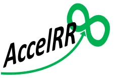

# Introducing my Personal Brand:  AccelRR8

In [a previous story](../Personal_Reflections/My_Big_Questions.md) I shared some deeply personal thoughts on my philosophy, which compels me to try to help as many people as I can, as much as I can, for as long as I can.

AccelRR8 is my brand for helping people through my vocation / career. Businesses and Non-Profit Organizations under the AccelRR8 brand are an extension of my philosophy and capabilities in pursuit of my interests.

Pronounced “Accelerate”, my brand is about helping leaders everywhere accelerate exponential success for themselves, for their companies and colleagues, and for humanity. “RR” is my initials. “8” is an infinity symbol turned sideways without the headache of trying to including an infinity symbol on legal documents and tax forms. It’s easier to see as infinity in the logo below.

My son Dominick pointed out that the “8” in the logo also looks like a butterfly in flight, which is important to our family because he is a big believer in the butterfly effect, which is itself evidence of exponential accelerators at work. We chose green to evoke growth and stewardship, blue-shifted to evoke trust and strength.